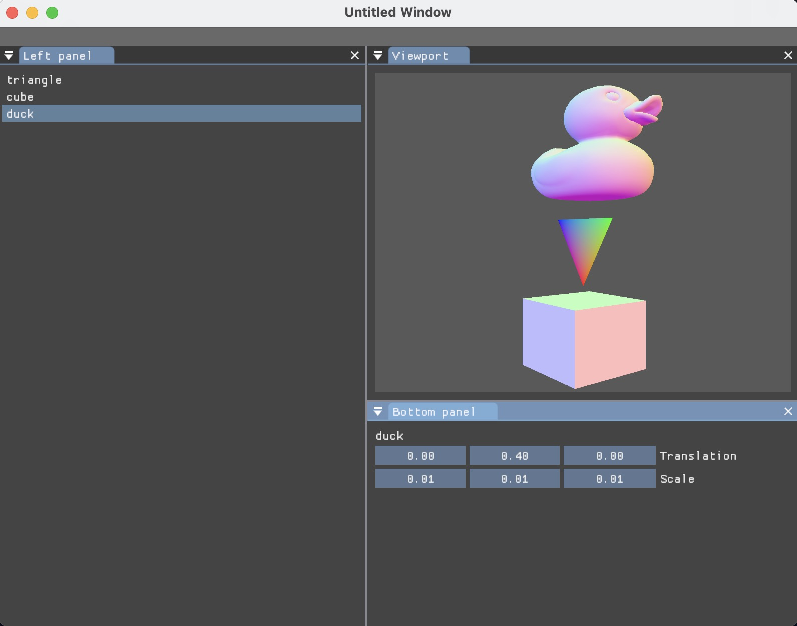

# The r4 engine

`r4` is a rendering engine written primarily in Zig.
I want it to be a framework with which I can create graphical programs
ranging from animation editors to ray-tracing model viewers to games.
Games aren't the _primary_ focus,
which is why I like to call it a "rendering engine" rather than a "game engine".

